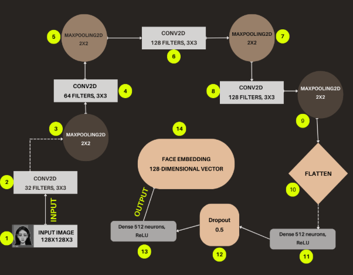
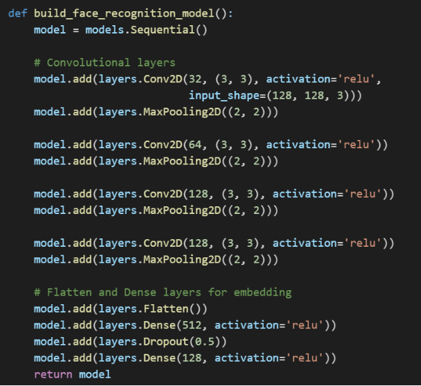
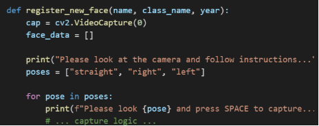
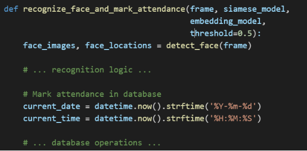

**Face Recognition Attendance System – Report**

**Overview**

The Report Generation Module is a critical component of our DNN-based face recognition attendance system, enabling administrators to generate comprehensive attendance reports, analyze attendance patterns, and export data for further processing. This document outlines the technical specification and implementation details for this module.

**1. System Overview**

This code implements a complete face recognition-based attendance management system using Python, OpenCV, TensorFlow, and Flask. The system can register students with their facial data, recognize them in real-time, mark attendance, and generate reports.

**2. System Architecture**

The system follows a multi-tier architecture combining:

1. **Computer Vision & Machine Learning Layer** - Handles face detection and recognition
1. **Data Persistence Layer** - Manages student and attendance records in SQLite
1. **Web Application Layer** - Provides a user interface through Flask

**3. Key Components**

**3.1 Database Structure**

The system uses SQLite with two main tables:

- **students** - Stores student information and face encodings
  - id (PRIMARY KEY)
  - name
  - class
  - year
  - face\_encoding (BLOB)
- **attendance** - Records attendance data
  - id (PRIMARY KEY)
  - student\_id (FOREIGN KEY → students.id)
  - date
  - time
  - status

**3.2 Face Recognition Implementation**

The face recognition pipeline has several components:

1. **Face Detection** - Uses OpenCV's Haar Cascade Classifier to detect faces in video frames
1. **Face Encoding** - A CNN model processes detected faces to generate embeddings
1. **Face Matching** - A Siamese Network architecture compares face embeddings for recognition
1. **Decision Making** - Threshold-based matching determines if a face belongs to a registered student

**3.3 Web Application**

The Flask web application provides four main pages:

1. **Index Page** - Live video feed for marking attendance
1. **Registration Page** - Form to register new students and capture face data
1. **Reports Page** - View and filter attendance records by date
1. **Users Page** - List of all registered students with search functionality

**4. Technical Implementation Details**

**4.1 Machine Learning Models**

**Convolutional Neural Network (CNN)**

**Flow Chart For The CNN Model**

**Siamese Network**

The Siamese network compares two face images by computing the Euclidean distance between their embeddings, enabling the system to determine if two faces belong to the same person.

**4.2 Face Registration Process**

The face registration process captures multiple poses to improve recognition:

This approach increases the robustness of the face recognition by capturing the face from different angles.

**4.3 Face Recognition and Attendance Marking**

This function processes video frames in real-time, recognizes students, and automatically marks their attendance in the database.

**5. User Interface Design**

The system employs a modern, responsive web interface with four main views:

1. **Main View (Mark Attendance)**
   1. Live video feed with face recognition
   1. Visual feedback on recognized students
1. **Registration View**
   1. Form for entering student details
   1. Face capture functionality
1. **Reports View**
   1. Date selector for filtering records
   1. Tabular display of attendance data
   1. Absent/present status indicators
1. **Users View**
   1. List of all registered students
   1. Search functionality

**6. System Workflow**

**6.1 Registration Workflow**

1. Administrator navigates to the registration page
1. Enters student information (name, class, year)
1. System captures face images from different angles
1. Face data is processed and stored in the database

**6.2 Attendance Marking Workflow**

1. System captures video frames from the camera
1. Face detection identifies faces in the frame
1. Face recognition compares detected faces with stored face encodings
1. If a match is found, attendance is marked in the database
1. Visual feedback is provided in the UI

**6.3 Reporting Workflow**

1. Administrator navigates to the reports page
1. Selects a date to view attendance records
1. System retrieves and displays attendance data for the selected date
1. Students not present are automatically marked as absent

**7. Conclusion**

This face recognition attendance system offers a complete solution for automating the attendance process in educational institutions. By combining computer vision, machine learning, and web technologies, it provides an efficient alternative to traditional attendance methods.

